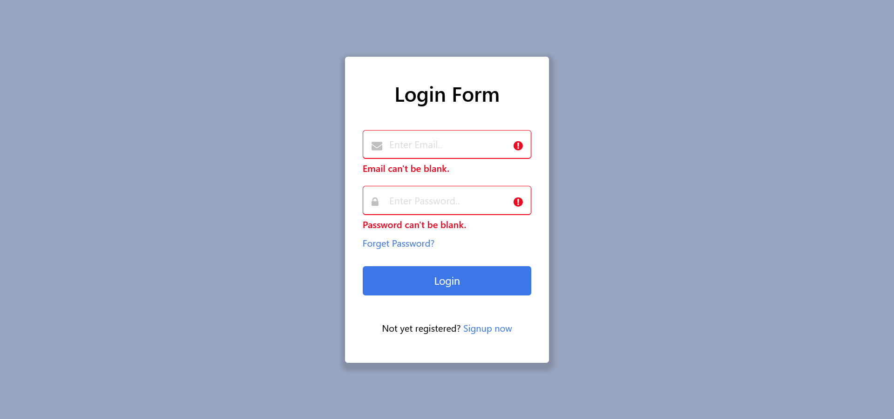

# Form Validation Using javaScript

This is a simple login form created using html and css. In this form i have implemented the email and password validation using javascript.

### [View the validation live](https://shankarlmc.github.io/form-validation-js/ "Form Validation" )

### Login Form

Enjoy ✌
